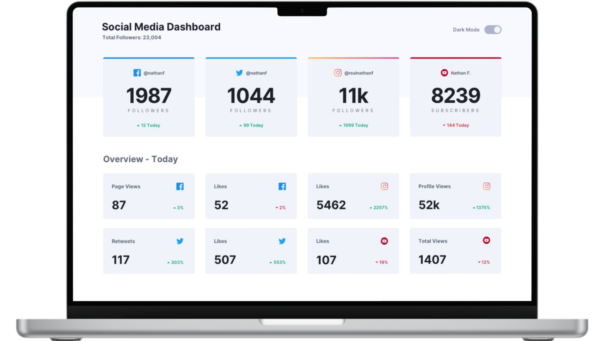

# Social Media Dashboard

<figure>
    
</figure>

## 📝 **Sobre o Projeto**

    Social Media Dashboard é uma aplicação web moderna e responsiva, desenvolvida com o conceito mobile-first. Conta com dark mode, animação de scroll suave e um design que se adapta perfeitamente a qualquer dispositivo. Oferece uma experiência visual envolvente, prática e personalizada para gestão de redes sociais.

[Demo do Projeto](https://dashboard-walacedev.netlify.app/) 

## 🛠️ **Tecnologias Utilizadas**

- **HTML5** para a estrutura do conteúdo.
- **CSS3** para estilização e design responsivo.
- **JavaScript** para funcionalidades dinâmicas.
- **Sass** (Syntactically Awesome Stylesheets) para pré-processamento de CSS.

## 🚀 **Recursos Principais**
- **Conceito Mobile First:** O design foi criado priorizando dispositivos móveis, garantindo uma experiência fluida e intuitiva, com adaptação perfeita para telas maiores.
- **Design Responsivo:** Layout flexível que oferece uma experiência consistente em qualquer dispositivo.
- **Dark Mode:** Um botão foi implementado para alternar entre os modos claro e escuro, proporcionando uma interface personalizável e confortável para diferentes condições de iluminação.
- **Animação de Scroll:** Adicionei uma animação suave ao rolar a página, criando uma experiência visual mais envolvente e fluida para os usuários.

 

## 📂 **Estrutura do Projeto**

├── src 
│   ├── assets          # Imagens 
│   ├── css             # Arquivo de estilização 
│   ├── js              # Arquivo de JavaScript 
│   └── sass            # Arquivos de pré-processador Sass 
├── .gitattributes      # Configurações de atributos do Git 
├── LICENSE             # Licença MIT 
├── README.md           # Documentação do projeto 
└── index.html          # Arquivo principal HTML do projeto

